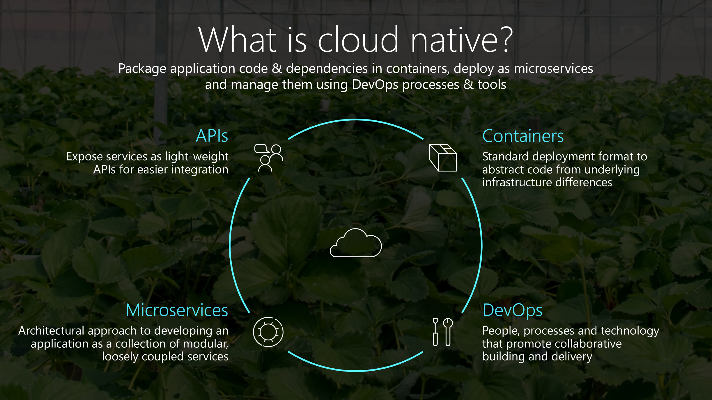
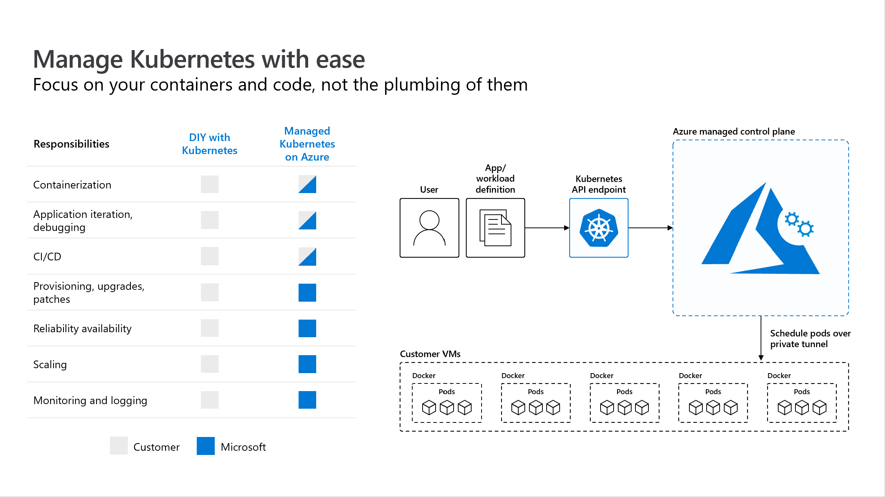
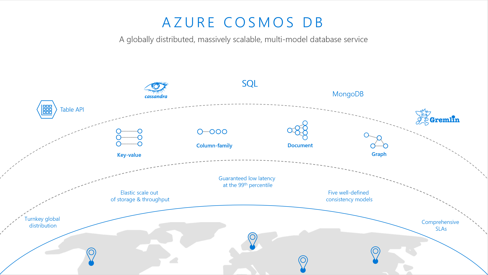

# Cloud-native and Kubernetes meetup content

This project is an index of cloud-native and Kubernetes meetup content.

## Presentations

| Asset | Description |
|---|-----|
|    [Cloud-native applications on Azure](presentations/cloud-native-apps-azure.pptx) | Start with presenting the cloud-native applications deck, which describes what they are and goes into a few scenarios like application modernization, real-time telemetry and geo-distributed apps with real customer examples and architecture diagrams. |
|      [Kubernetes on Azure](presentations/k8s-on-azure.pptx) | Follow by diving into more details on running Kubernetes on Azure with Azure Kubernetes Service. |
|     [Azure Cosmos DB](presentations/azure-cosmos-db.pptx) | Then talk about using Azure Cosmos DB, a globally distributed, massively scalable, multi-modal database service to build modern applications. |

## Videos

| Asset | Description | Type | Notes |
|---|-----|-----|----|----|
| [AKS Diagnostics](videos/AKSDiagnositcs.mp4) | Overview of using AKS diagnostics within the Azure portal. | video | ~ 23 sec |
|[Azure Arc Overview](videos/Azure Arc - Kubernetes - KubeCon - Screens.pptx) | Guided screen by screen overview of Azure Arc for Kubernetes. Covers onboarding, configuration, Policy, and Monitoring.| PowerPoint | 32 slides |
| [Azure Dev Spaces](videos/Azure Dev Spaces.mp4) | Recorded debugging session of Rock, paper, scissors game built using microservices and running on Kubernetes. Debugging done using Azure Dev Spaces extension for Visual Studio Code. Includes discussion of using GitHubs Actions workflow for propagating the fix to rest of the team. | Video | ~6 minutes |
| [Confidential computing for Kubernetes](videos/Confidential computing for Kubernetes.mp4) | Overview of Confidential computing and key scenarios.  | Video | ~1 min 20 sec |
| [Container Insights demo](videos/Container Insights KubeCon demo.mp4) | Demo of using Azure Monitor for container insights. Shows drilldowns, filtering and similar capabilities to zero in on relevant insights.   | Video | ~8 mins |

## Hands-on content and demos

From content on Microsoft Learn, tutorials to sample applications, use this content to run a 2-3 hour workshop, or extend it over 2 days.

### Getting started with cloud-native application development

- [Get started with Kubernetes on Azure workshop on Microsoft Learn](https://aka.ms/learn/aksworkshop)
- [Rock, paper, scissors, lizard, spock sample application](https://docs.microsoft.com/en-us/samples/microsoft/rockpaperscissorslizardspock/azure-rock-paper-scissors/)

### Azure Kubernetes Service 10 minute labs
- [Deploy using GitHub Actions into Azure Kubernetes Service](https://azure.github.io/kube-labs/1-github-actions.html)
- [Improve debugging experience using Dev Spaces Connect](https://azure.github.io/kube-labs/2-devspaces-connect.html)
- [Build a Dapr pub-sub-app using Visual Studio Code](https://azure.github.io/kube-labs/3-dapr-pubsub.html)
- [Trace applications using Application Insights](https://azure.github.io/kube-labs/5-aks-appinsights.html)

### Bike Sharing application: Streamlining the development workflow

- [Deploy the Bike Sharing application to Azure Kubernetes Service tutorial](https://github.com/Azure/dev-spaces/tree/master/samples/BikeSharingApp)
- [Connect your development machine to an Azure Kubernetes Service cluster tutorial](https://docs.microsoft.com/en-us/azure/dev-spaces/how-to/connect)
- [Team development on Kubernetes using Dev Spaces tutorial](https://docs.microsoft.com/en-us/azure/dev-spaces/quickstart-team-development)
- [Combine GitHub Actions with Dev Spaces in a pull request review tutorial](https://docs.microsoft.com/en-us/azure/dev-spaces/how-to/github-actions)

### Tailwind Traders: A fictitious retail company showcasing the future of intelligent application experiences

- [Tailwind Traders sample application](https://microsoft.github.io/TailwindTraders/)

# Contributing

This project welcomes contributions and suggestions.  Most contributions require you to agree to a
Contributor License Agreement (CLA) declaring that you have the right to, and actually do, grant us
the rights to use your contribution. For details, visit https://cla.opensource.microsoft.com.

When you submit a pull request, a CLA bot will automatically determine whether you need to provide
a CLA and decorate the PR appropriately (e.g., status check, comment). Simply follow the instructions
provided by the bot. You will only need to do this once across all repos using our CLA.

This project has adopted the [Microsoft Open Source Code of Conduct](https://opensource.microsoft.com/codeofconduct/).
For more information see the [Code of Conduct FAQ](https://opensource.microsoft.com/codeofconduct/faq/) or
contact [opencode@microsoft.com](mailto:opencode@microsoft.com) with any additional questions or comments.

# Legal Notices

Microsoft and any contributors grant you a license to the Microsoft documentation and other content
in this repository under the [Creative Commons Attribution 4.0 International Public License](https://creativecommons.org/licenses/by/4.0/legalcode),
see the [LICENSE](LICENSE) file, and grant you a license to any code in the repository under the [MIT License](https://opensource.org/licenses/MIT), see the
[LICENSE-CODE](LICENSE-CODE) file.

Microsoft, Windows, Microsoft Azure and/or other Microsoft products and services referenced in the documentation
may be either trademarks or registered trademarks of Microsoft in the United States and/or other countries.
The licenses for this project do not grant you rights to use any Microsoft names, logos, or trademarks.
Microsoft's general trademark guidelines can be found at http://go.microsoft.com/fwlink/?LinkID=254653.

Privacy information can be found at https://privacy.microsoft.com/en-us/

Microsoft and any contributors reserve all other rights, whether under their respective copyrights, patents,
or trademarks, whether by implication, estoppel or otherwise.
